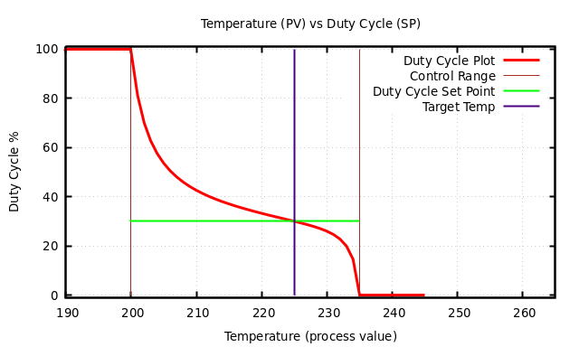
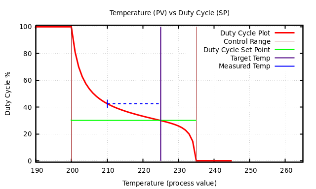
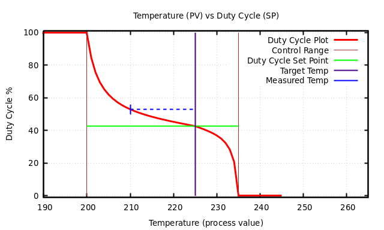

# yap-controller
Yet Another Process Controller - PID like conroller

## Overview

For all graphs:
- The "Duty Cycle Plot" shows duty cycle based on measured process value
- The "Control Range" is the lower/upper process value range where the duty cycle is actively managed.
  For process values below the lower range the duty cycle will be set to 100%.
  For rocess values above the upper range the duty cycle will be set to 0%.
- The "Duty Cycle Set Point" is initially an estimate.
- The "Target Temp" is the stable temperature goal.



This is the initial configuration. As the temperature rises above 200 the duty cycle drops.



At some point the temperature stablizes, in this example 210 degrees.
Because this is not the target temperature, the duty cycle set point is changed to the value at the intersection of the stable temperature (42.57564)



Changing the duty cycle set point redraws the plot line. This yeilds a new duty cycle (52.89203) for the current temperature (210). The cycle repeats itself until the measured temperature stablizes at the target temperature.

The following code was used to generate these graphs:
```python
if __name__ == "__main__" :
    yap = YAPController (None ,
                      225.0 ,       # target process value (temperature)
                      30.0 ,        # initial set point (duty cycle)
                      PV_low = 200.0 ,  # lower control range temperature
                      PV_high = 235.0)  # upper control range temperature
    with open ("YAPover1.gnuplot", "w") as fil :
        print (yap.gnuplot (out_file = fil))
    with open ("YAPover2.gnuplot", "w") as fil :
        new_duty_cycle = yap.gnuplot (process_value=210, out_file = fil)
    print (new_duty_cycle)
    yap.set_duty_cycle (new_duty_cycle)
    with open ("YAPover3.gnuplot", "w") as fil :
        new_duty_cycle = yap.gnuplot (process_value=210, out_file = fil)
    print (new_duty_cycle)
```